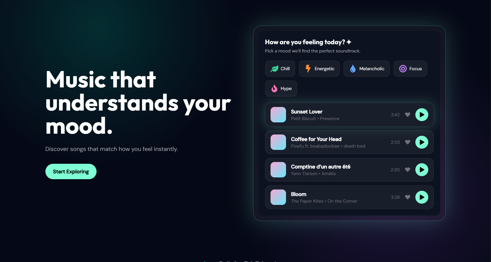
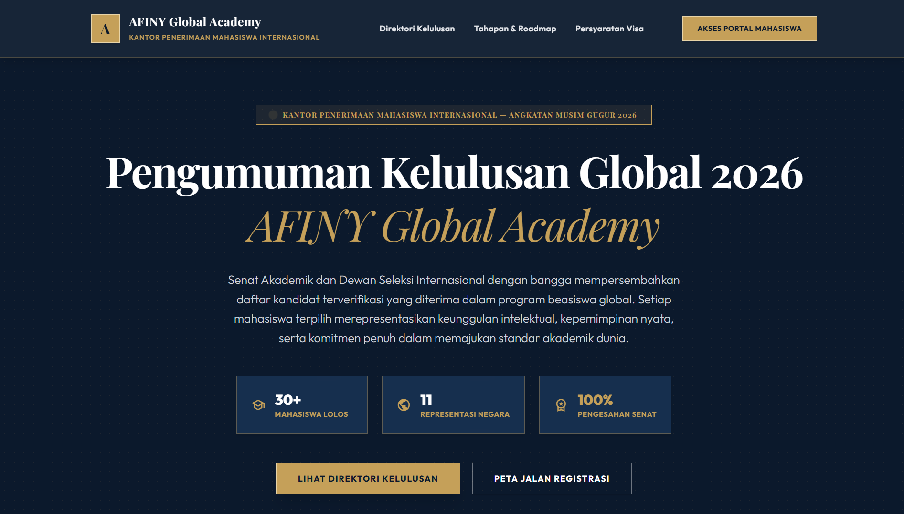
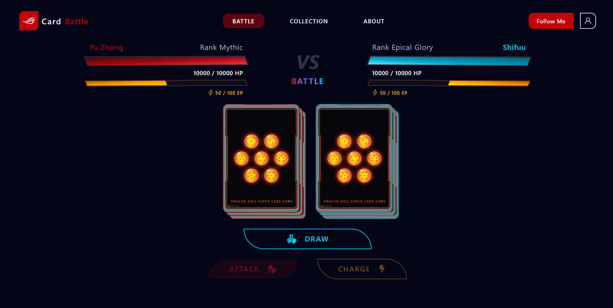
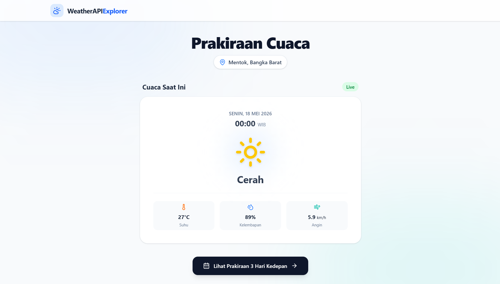
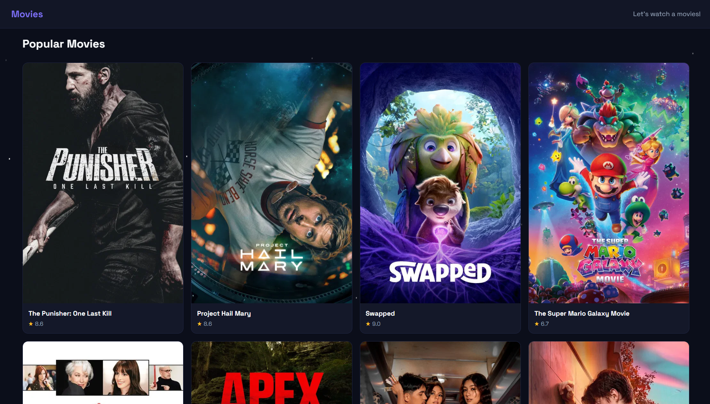
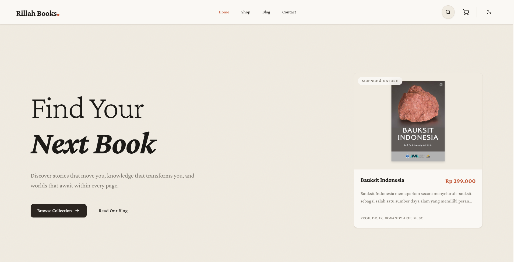
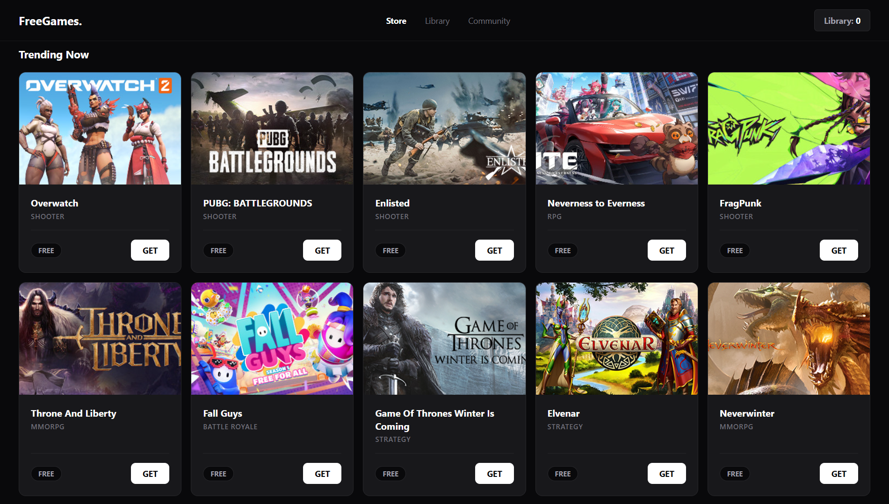
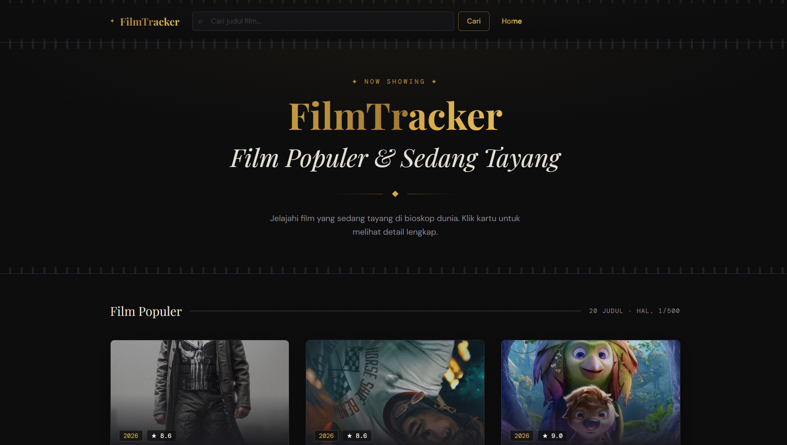
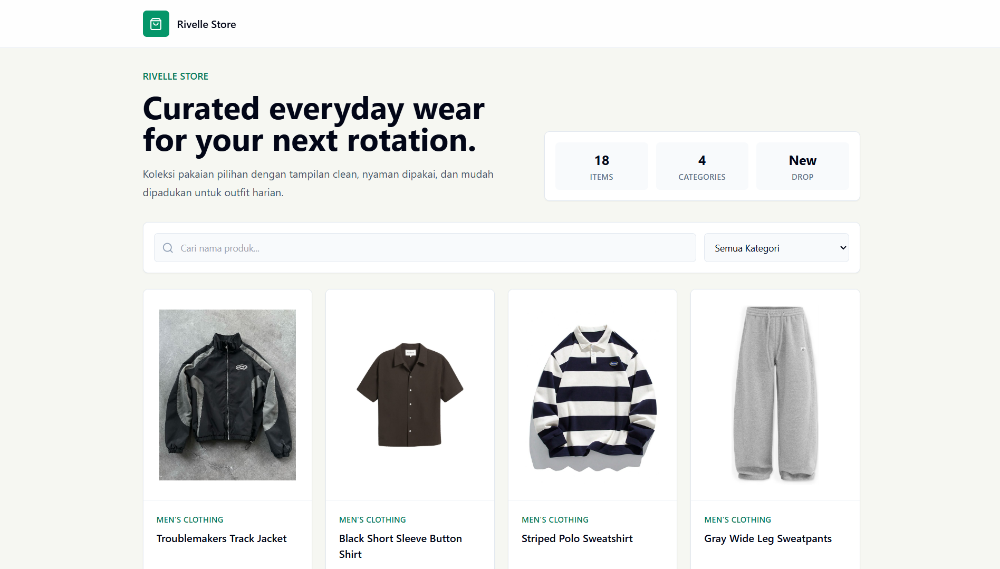
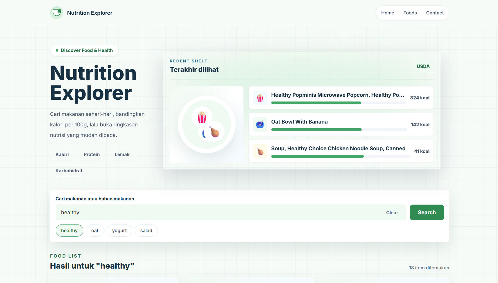

# Frontend Development Midterm Project
### **Best Midterm Project**:  Faiz
### **Honorable Mention:** Awan

### **Feedback**
#### **Faiz**

- ide api music player dan bisa di-play (+)
- ada docs (+)
- custom hook (+)
- env exposed (-)
- **Nilai: A+**
#### **Awan**

- ada docs (+)
- UI menarik sesuai tema (+)
- ide api (+)
- bisa printing (+)
- env exposed (-)
- ui loading jangan disamakan dengan ui error di detail page
- **Nilai: A+**
#### **Prisma**

- tambahkan ui untuk menampilkan error dari error handling
- custom hooks (+)
- ide api unik (+)
- **Nilai: A**
#### **Deza** 

- ide api (+)
- Commit cuma 1 ga conventional (-)
- Env exposed (-)
- jangan hanya satu daerah (-)
- seperate of concern di API (-)
- tampilan UI (-)
- **Nilai: A-**
#### **Atala**

- pakai library icon
- handling image error
- button image error
- seperate of concern API
- **Nilai: A**
#### **Rillah**

- Pakai Typescript dan zustand (-)
- pas pindah halaman auto ke footer (-)
- error handling seharusnya ditampilkan di ui, jangan hanya console 
- ada docs (+)
- pakai skeleton loading (+)
- dark mode (+)
- optimasi dengan useMemo (+)
- revisi: done
- **A-**
#### **Akbar**

- bisa pakai library slider daripada scroll x dan library toast untuk notif
- ui improve dari sebelumnya (+)
- env exposed (-)
- **Nilai: A-**
#### **Koko**

- UI menarik (+)
- Pagination (+)
- **Nilai: A**
#### **Enjel**

- UI bisa diimprove, terlihat AI dari navbar
- searching realtime via client (+)
- optimasi useMemo (+)
- **Nilai: A-**
#### **Aul**

- Ketentuan terpenuhi
- ui menarik (+)
- searching tidak berjalan dengan baik, lebih baik dihapus, gunakan filter button di bawah  (-)
- **Nilai: A**